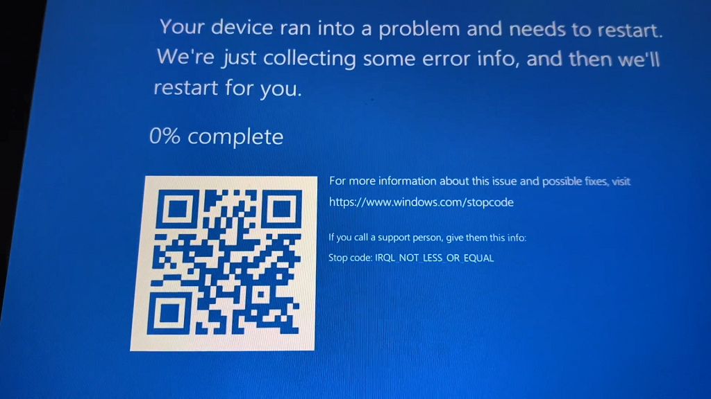

# CVE-2021-32537: Out-of-bounds access in RTKVHD64 leading to pool corruption. 

This is a bug that I reported to [Realtek](https://www.realtek.com/en) beginning of April 2021. The affected driver is named `RTKVHD64.sys` and seems to be available on a bunch of mainstream hardware (tested the below hardware configurations but probably more are vulnerables):

- Microsoft Surface Laptop,
- Microsoft Surface Book,
- Microsoft Surface Pro,
- Lenovo Thinkpad,
- Dell XPS 13.

I've been told by Realtek that the vulnerability is patched and that the fix is distributed by Windows Update which I haven't been able to verify myself. This is the documentation released by [Taiwan Computer Emergency Response Team](https://www.twcert.org.tw/en/mp-2.html): [TVN-202106002 / CVE-2021-32537](https://www.twcert.org.tw/en/cp-139-4814-e0860-2.html).

Binaries are available in the release section.



## Root cause analysis

During initialization, the driver allocates structures on the kernel pool. In `InitDeviceExtension` called by `StartDevice` (parameter of `PcAddAdapterDevice`):

```C
devext->unk->events = ExAllocatePoolWithTag(pooltype, 0x5F0ui64, 'mEvt');

struct EVT {
    PKSPIN_LOCK lock;
    PVOID       event;
    UINT64      someflag;
} /* sizeof == 0x18 */

struct MEVT {
    struct EVT array[63];
    UINT64 flags;
} /* sizeof == 0x18*63 + 8 == 0x5f0 */
```

The `EVT` array has a fixed size of 63 elements. When sending `0x225f04` IOCTL to the driver, the first `DWORD` of the input is used as an array index without  any sanitization:

```C
input_index = *(_DWORD *)IrpSystemBuffer;
    v5 = Crash(
        mevts,
        stack->FileObject,
        unk,
        &mevts->array[input_index].event,
        (KSPIN_LOCK *)&mevts->array[input_index]);
```

`Crash` calls `KeAcquireSpinLockRaiseToDpc` using the `KSPIN_LOCK` pointer `&mevts->array[input_index]` which is out-of-bounds.
This leads to the following BSoD when setting `input_index` to `0xaaaaaaaa`:

```text
5: kd> !analyze -v
*******************************************************************************
*                                                                             *
*                        Bugcheck Analysis                                    *
*                                                                             *
*******************************************************************************

IRQL_NOT_LESS_OR_EQUAL (a)
An attempt was made to access a pageable (or completely invalid) address at an
interrupt request level (IRQL) that is too high.  This is usually
caused by drivers using improper addresses.
If a kernel debugger is available get the stack backtrace.
Arguments:
Arg1: ffffac983ca17910, memory referenced
Arg2: 0000000000000002, IRQL
Arg3: 0000000000000001, bitfield :
	bit 0 : value 0 = read operation, 1 = write operation
	bit 3 : value 0 = not an execute operation, 1 = execute operation (only on chips which support this level of status)
Arg4: fffff8065d8e4793, address which referenced memory

TRAP_FRAME:  ffffd60852d52d30 -- (.trap 0xffffd60852d52d30)
NOTE: The trap frame does not contain all registers.
Some register values may be zeroed or incorrect.
rax=0000000000000000 rbx=0000000000000000 rcx=0000000000000000
rdx=ffffac885763cbc0 rsi=0000000000000000 rdi=0000000000000000
rip=fffff8065d8e4793 rsp=ffffd60852d52ec0 rbp=ffffac883ca17920
 r8=aaaaaaaaaaaaaaaa  r9=ffffac983ca17918 r10=ffffac883ca17920
r11=aaaaaaaaaaaaaaaa r12=0000000000000000 r13=0000000000000000
r14=0000000000000000 r15=0000000000000000
iopl=0         nv up ei pl zr na po nc
nt!KeAcquireSpinLockRaiseToDpc+0x53:
fffff806`5d8e4793 f0480fba2b00    lock bts qword ptr [rbx],0 ds:00000000`00000000=????????????????
Resetting default scope

STACK_TEXT:  
ffffd608`52d52be8 fffff806`5da07b69     : 00000000`0000000a ffffac98`3ca17910 00000000`00000002 00000000`00000001 : nt!KeBugCheckEx
ffffd608`52d52bf0 fffff806`5da03e69     : 00000000`00000002 ffffdf00`8a8c0180 00000000`00000003 fffff806`5d84b0b6 : nt!KiBugCheckDispatch+0x69
ffffd608`52d52d30 fffff806`5d8e4793     : ffffd608`52d52fb0 00000000`00000190 00000000`00000001 ffffac88`5763b770 : nt!KiPageFault+0x469
ffffd608`52d52ec0 fffff806`5b996dc1     : aaaaaaaa`aaaaaaaa ffffac88`4b86ba00 ffffd608`52d53440 00000000`00000040 : nt!KeAcquireSpinLockRaiseToDpc+0x53
ffffd608`52d52ef0 fffff806`5b996b1f     : ffffac88`4b86ba00 00000000`00000000 ffffac88`52fe7d40 fffff806`5d867ce0 : RTKVHD64+0x16dc1
ffffd608`52d52f20 fffff806`5bb49455     : ffffac88`3ca17920 00000000`c0000002 00000000`00000001 fffff806`00000000 : RTKVHD64+0x16b1f
ffffd608`52d52fc0 fffff806`5bb6e6d0     : 00000000`c0000001 ffffac88`4b86bc38 ffffac88`3c9471a0 ffffac88`3c9471a0 : RTKVHD64+0x1c9455
ffffd608`52d53020 fffff806`5d852f55     : ffffac88`4b86ba00 ffffd608`52d53100 ffffac88`4b86bc80 ffffac88`3c276ce0 : RTKVHD64+0x1ee6d0
ffffd608`52d53070 fffff806`5bf416bf     : ffffac88`4b86ba00 ffffd608`52d53100 ffffac88`4b86bc80 ffffac88`3c276ce0 : nt!IofCallDriver+0x55
ffffd608`52d530b0 fffff806`5bf41023     : ffffac88`4b86ba00 00000000`00000001 00000000`00000000 ffffac88`5763cbc0 : ksthunk!CKernelFilterDevice::DispatchIrp+0x23b
ffffd608`52d53110 fffff806`5d852f55     : 00000000`0000000e 00000000`00000000 ffffd608`20206f49 00000000`00000001 : ksthunk!CKernelFilterDevice::DispatchIrpBridge+0x13
ffffd608`52d53140 fffff806`5dbfd898     : ffffd608`52d534c0 ffffac88`4b86ba00 00000000`00000001 ffffac88`574de0c0 : nt!IofCallDriver+0x55
ffffd608`52d53180 fffff806`5dbfd165     : 00000000`00225f04 ffffd608`52d534c0 00000000`00000005 ffffd608`52d534c0 : nt!IopSynchronousServiceTail+0x1a8
ffffd608`52d53220 fffff806`5dbfcb66     : 00007ffe`eb9fda90 00000000`00000000 00000000`00000000 00000000`00000000 : nt!IopXxxControlFile+0x5e5
ffffd608`52d53360 fffff806`5da075b5     : 00000000`00000000 00000000`00000000 00000000`00000000 00000000`00000000 : nt!NtDeviceIoControlFile+0x56
ffffd608`52d533d0 00007ffe`edf2ccf4     : 00000000`00000000 00000000`00000000 00000000`00000000 00000000`00000000 : nt!KiSystemServiceCopyEnd+0x25
000000fd`e0eff8b8 00000000`00000000     : 00000000`00000000 00000000`00000000 00000000`00000000 00000000`00000000 : 0x00007ffe`edf2ccf4

5: kd> db ffffac983ca17910-(0xaaaaaaaa*0x18)
ffffac88`3ca17920  00 00 00 00 00 00 00 00-70 83 2e 38 88 ac ff ff  ........p..8....
ffffac88`3ca17930  00 00 00 00 00 00 00 00-00 00 00 00 00 00 00 00  ................
ffffac88`3ca17940  40 8c 8f 44 88 ac ff ff-00 00 00 00 00 00 00 00  @..D............
ffffac88`3ca17950  00 00 00 00 00 00 00 00-d0 83 2e 38 88 ac ff ff  ...........8....
ffffac88`3ca17960  00 00 00 00 00 00 00 00-00 00 00 00 00 00 00 00  ................
ffffac88`3ca17970  e0 85 2e 38 88 ac ff ff-00 00 00 00 00 00 00 00  ...8............
ffffac88`3ca17980  00 00 00 00 00 00 00 00-90 84 2e 38 88 ac ff ff  ...........8....
ffffac88`3ca17990  00 00 00 00 00 00 00 00-00 00 00 00 00 00 00 00  ................

5: kd> !pool ffffac88`3ca17920
Pool page ffffac883ca17920 region is Nonpaged pool
 ffffac883ca17000 size:  900 previous size:    0  (Allocated)  PFXM
*ffffac883ca17910 size:  600 previous size:    0  (Allocated) *tvEm
		Owning component : Unknown (update pooltag.txt)
 ffffac883ca17f10 size:   d0 previous size:    0  (Free)       2.3.
```
